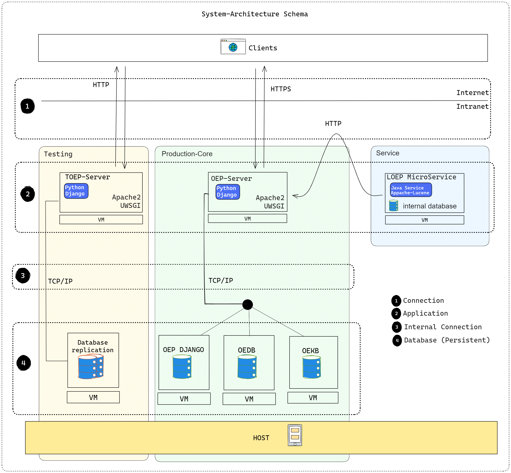

The diagram shows the software architecture of openenergyplatform.org.  

In summary, the architecture is made up of various technologies that are installed on several servers.The individual servers each take on a specific responsibility in order to guarantee the functional scope of the open energy platform. As shown, the individual elements communicate via defined interfaces either via the internet (http) or in the internal network (TCP/IP).

Basically, the openenergyplatform is a monolithic application as the functional core is developed together in a code base for frontend and backend. The application logic, database structure, web APIs and user interface are thus provided in the production system.

In the course of development, more modern architectures were introduced, which are shown as services in the illustration. The LOEP service performs a specific task for which a user sends data to the service interface. The service has its own backend that processes the data and returns a suitable response. This architecture makes the system more modular.

The database layer is always close to the applications and provides fast data access for the application via the internal network. In addition to application data such as user accounts, which are stored in the OEP Django database, there is the OEDB, which manages large amounts of data uploaded by users.
The OEKB serves as a database for storing complex data. This involves data that has many attributes and relationships and is stored in the form of data triples. This enables high-performance and complex semantic data queries.

The entire productive system and the databases are replicated in a test environment. Here, new versions of the software are installed before the official release and can be tested under real conditions.

!!! Note
    LOEP-Service is currently not included in the installation instructions.

## Technologies
