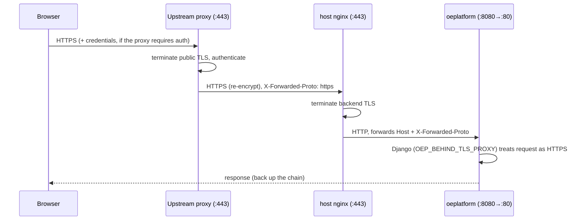
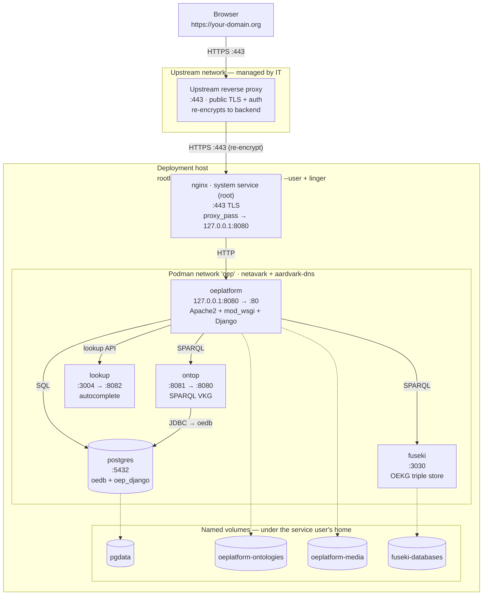

<!--
SPDX-FileCopyrightText: 2026 Jonas Huber <https://github.com/jh-RLI> © Reiner Lemoine Institut

SPDX-License-Identifier: AGPL-3.0-or-later
-->

# Production deployment (Podman) — Overview & architecture

!!! info "You are here"

    Start of the **Production deployment (Podman)** guide. This page explains
    _what_ the stack is and _how_ the pieces fit together. When you understand
    the architecture, continue to **Install**.

This guide describes the **production** deployment of the Open Energy Platform
using **rootless Podman** with **systemd Quadlets**. It is the canonical,
supported production path.

!!! note "Not the development setup"

    The `docker` / `podman-compose` paths documented elsewhere in these docs are
    for **development and CI**. For a real server, follow this section.

## The stack at a glance

- The application runs as a set of **rootless Podman** containers owned by an
  unprivileged service user, managed as **systemd `--user` Quadlets** — one
  systemd unit per service, with **linger** enabled so they survive logout and
  reboot.
- A **root nginx** on the host terminates TLS on port **443** and
  reverse-proxies plain HTTP to the app container (which listens only on
  `127.0.0.1`). Rootless containers cannot bind privileged ports, so nginx
  (running as root) owns `:443`.
- All services share one **`oep` Podman network** (netavark + aardvark-dns), so
  they reach each other by container name (`postgres`, `fuseki`, `ontop`, …).
- Persistent data lives in **named volumes**, physically under the service
  user's home directory. Where that home lives — and therefore where the data
  physically sits — is a per-server storage decision, not part of this generic
  guide.
- **One config file** drives everything: `~/.config/oeplatform/oep.env` is read
  by every container unit, and nginx reads the public domain from it too.

## Services

| Service        | Role                                                                                                     |
| -------------- | -------------------------------------------------------------------------------------------------------- |
| **oeplatform** | The Django web application (Apache2 + mod_wsgi). Serves the platform.                                    |
| **postgres**   | PostgreSQL: the OEDB (`oedb`) data tables + the Django DB (`oep_django`).                                |
| **fuseki**     | Apache Jena Fuseki triple store (the OEKG / SPARQL knowledge graph).                                     |
| **ontop**      | A SPARQL-over-SQL endpoint (Virtual Knowledge Graph) exposing OEDB tables as RDF via a semantic mapping. |
| **lookup**     | Term autocomplete / lookup — see below.                                                                  |
| **nginx**      | Host package (not a container): terminates backend TLS on `:443` and proxies to the app.                 |

### The lookup service

The **lookup** service runs
[**DBpedia Lookup**](https://github.com/dbpedia/lookup), a generic lookup engine
over **any SPARQL-compatible source**. Rather than querying a SPARQL endpoint
live on every request, it **indexes** the results of configured queries into a
local index and then serves fast **prefix / keyword lookups** against that
index. In OEP it is used to autocomplete ontology terms (e.g. when annotating
metadata). Its behaviour is driven by two kinds of config:

- a **service config** (`config.yaml`) — the searchable fields and match/boost
  tuning, and
- one or more **indexers** — each names a `sparqlEndpoint` and the SPARQL
  queries that populate the index fields.

The indexer wiring (which endpoint is indexed, and how) is covered as a config
point in **Install**.

## Request & TLS flow

The public entry point is typically an **upstream reverse proxy** (managed by
your institution's IT) that terminates the public TLS certificate,
authenticates, and then **re-encrypts** to this host over HTTPS. That means TLS
is terminated **twice**: once at the upstream proxy (public cert) and once at
the host nginx (a backend cert, which may be self-signed — the upstream proxy
typically does not verify the backend cert).

!!! note "If you have no upstream proxy"

    The host nginx can also face the public directly. In that case you terminate
    a real (e.g. Let's Encrypt) certificate at nginx instead of a self-signed
    backend cert. This guide assumes the upstream-proxy layout; adapt the
    certificate accordingly.

## Topology

## Design principles worth knowing

- **Self-provisioning images.** The app image bakes in the OEO ontology release
  and the OEO-extended template and seeds them into volumes on first start. The
  ontop image bakes in its JDBC driver, ontology and a (safe, empty) mapping.
  You do not place these files by hand.
- **Config is environment, not files.** Credentials, the public host, and HTTPS
  behaviour all come from `oep.env`. There are no per-service config files to
  hand-edit for a normal deployment (the two exceptions — the lookup config and
  a real ontop mapping — are called out where relevant).
- **systemd owns the lifecycle.** Start-on-boot, restart-on-failure, dependency
  ordering and logs all go through `systemctl --user` / `journalctl --user`.

!!! tip "OEP-internal specifics live elsewhere"

    This guide is generic and uses placeholders (`your-domain.org`,
    `<db-password>`, …). The concrete values, hostnames and server paths for the
    OEP team's own servers are maintained separately (internal runbook), not in
    this public documentation.

---

**Next → [Install](install.md)** — bring the whole stack up on a fresh host.
