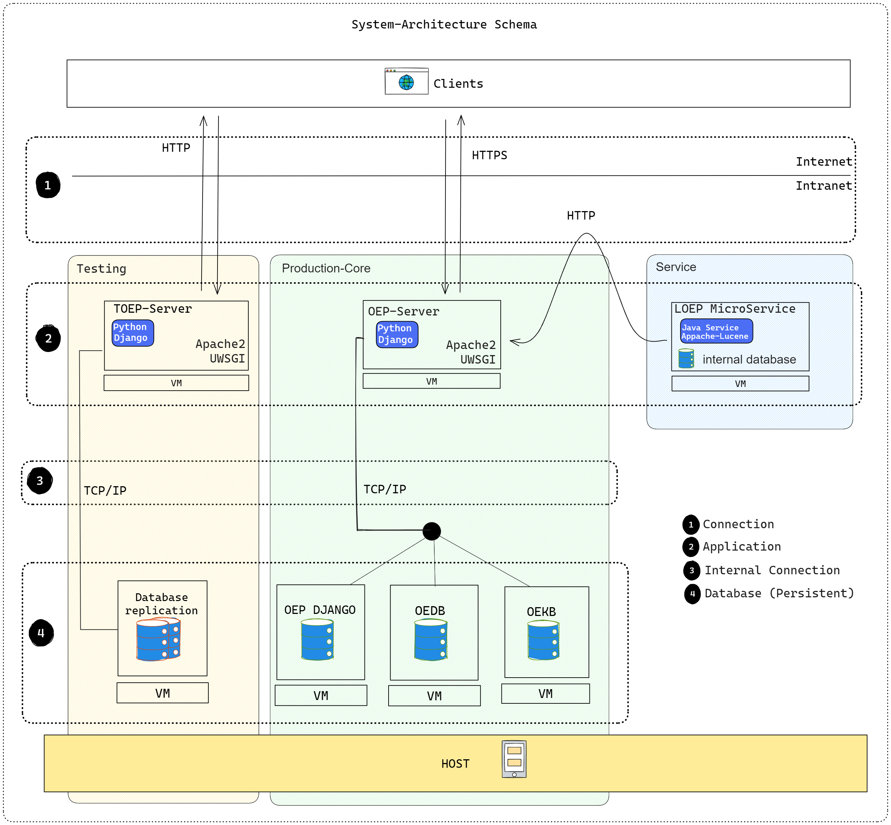

<!--
SPDX-FileCopyrightText: 2025 Jonas Huber <https://github.com/jh-RLI> © Reiner Lemoine Institut

SPDX-License-Identifier: CC0-1.0
-->

## Infrastructure & Service Architecture

In summary, the architecture is made up of various technologies that are installed on several servers.The individual servers each take on a specific responsibility in order to guarantee the functional scope of the open energy platform. As shown, the individual elements communicate via defined interfaces either via the internet (http) or in the internal network (TCP/IP).

Basically, the OpenEnergyPlatform is a monolithic application as the functional core is developed together in a code base for frontend and backend. The application logic, database structure, web APIs and user interface are thus provided in the production system.

In the course of development, more modern architectures were introduced, which are shown as services in the illustration. The LOEP service performs a specific task for which a user sends data to the service interface. The service has its own backend that processes the data and returns a suitable response. This architecture makes the system more modular.

The database layer is always close to the applications and provides fast data access for the application via the internal network. In addition to application data such as user accounts, which are stored in the OEP Django database, there is the OEDB, which manages large amounts of data uploaded by users.
The OEKB serves as a database for storing complex data. This involves data that has many attributes and relationships and is stored in the form of data triples. This enables high-performance and complex semantic data queries.

The entire productive system and the databases are replicated in a test environment. Here, new versions of the software are installed before the official release and can be tested under real conditions.

!!! Note
    The diagram shows the software architecture of openenergyplatform.org.

## Technologies

Out technology stacks describes the inventory of all larger software libraries or frameworks we currently implement in the infrastructure of the OpenEnergyPLatform. The oeplatform website project does not implement all of these technologies directly as some are developed as service meaning that the software runs independently form the oeplatform but these services offer a specific functionality that is required by some of the oeplatforms use cases / features.

The "oeplatform" project depends on the these technologies:

- Python (Version 3.10)
- Django (version 5.1, Webframework)
- Django rest framework (WEB-API)
- django-allauth (login / registration / SSO)
- SQLAlchemy (Primary-Database access)
- Postgresql (version 15, database)
- sparqlWrapper, RDFLib, owlready2 (Ontology & OEKG access)

Below the services of the oeplatform are named and it is shown on which technologies they depend:

Lookup-OEP (LOEP)
This service implements a semantic search for the contents of the OpenEnergyOntology. It is used to implement the Ontological Annotation and can be used in the GUI for the oeplatforms "metaBuilder" feature. It enables a core use-case of the oeplatform website as it implements the first step of the quantitative scenario comparison.

- Java
- Apache Lucence
- Ontology file

Open Energy Knowledge Graph (OEKG)
It is a triple store that is persistent and is extended constantly based on user input. User of the oeplatform add data to the triple store when they create or extend Scenario Bundles via the website. The services itself offer an API to search & update data to its database.

- Apache Jenna-Fuseki

OEVKG
This service is part of the scenario comparison that is implemented in the scenario bundles feature on the oeplatform. It enables ontology based data access by using a virtual knowledge graph based on a sematic mapping. The base for the semantic mapping is provided by the user when doing the ontological annotation of data resources mentioned in the Lookup-OEP service above.

- Java
- Ontop-VKG

Databus
A metadata registry implementing data management functionality needed by the oeplatform. The databus enables a advanced semantic search across all table resources on the OEP-Website and also its metadata. Additionally it enables storing data sources in groups, create version and collections of multiple unrelated data resources and more. It offers API´s which are used by the oeplatform to interact with the databus.

- Java
- Virtuoso

MOSS
.....
