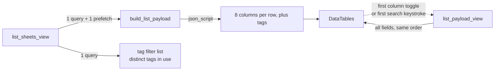

<!--
SPDX-FileCopyrightText: 2026 Jonas Huber <https://github.com/jh-RLI> © Reiner Lemoine Institut

SPDX-License-Identifier: CC0-1.0
-->

# Factsheets — architecture & developer guide

This page records how the `modelview` app is built and, where it matters, **why
it is built that way**. Several of the decisions below look like arbitrary style
until you know which defect they exist to prevent, so each one names it.

## The shape of the data

`BasicFactsheet` is a concrete model with no `Meta`, and `Energymodel` and
`Energyframework` inherit from it. That makes them **multi-table inheritance**:
every row is two rows, `bulk_create` is refused for the children, and the `tags`
many-to-many is declared on the **parent** — so its through-table foreign key is
named for `basicfactsheet`, not for the child being written.

Two consequences that catch people out:

- `BasicFactsheet.model_name` is **UNIQUE on the parent**, so a factsheet name
  is unique across _both_ sheet types.
- Selecting over `BasicFactsheet` reaches models and frameworks in one query. A
  models-only sweep silently misses the frameworks.

`Energyframework.data_api` is `NOT NULL` with no default, so a bare `create()`
of a framework fails.

## The list page



**Three queries, whatever the number of factsheets.** The factsheet queryset,
its `tags` prefetch, and the sidebar's filter list. It used to be `7 × N + 2` —
2,138 at production's shape.

### The row payload is built in the view

`modelview/list_payload.py` returns one dict per factsheet. It is not in the
template any more, and that is the point: the template emitted each row's
`model_name` and `tags` _inside_ the loop over the field groups, so they were
written once per group — seven times per model factsheet. Duplicate keys in a
JavaScript object literal silently overwrite, so the page looked correct while
shipping 85,092 tag objects for 12,156 attachments. **A dict cannot have that
bug.**

Three properties of the builder are load-bearing:

- **`prefetch_related("tags")` is a precondition, not an optimisation.** Without
  it the payload is one query per factsheet per field group again.
- **Every row carries its _complete_ tag array**, never the five the renderer
  displays. The browser-side filter iterates the whole list to decide whether a
  row matches, so a capped array would silently stop filtering any factsheet
  with more than five tags.
- **`_cell` escapes HTML.** DataTables writes every cell through `innerHTML`,
  and any logged-in account can edit any factsheet. The payload's transport is
  protected separately (below); this protects the _cell_.

### It reaches the browser as JSON, not as JavaScript

The payload is emitted with Django's `json_script`, never `|safe`. `json_script`
escapes `<`, `>` and `&` to unicode escapes, so no field value can close the
script element — which a factsheet whose text contains `</script>` otherwise
does, taking the rest of the page with it.

### The payload is page-sized

The initial payload carries only the **default columns**: eight keys per model
row, five per framework row. The remaining fields come from
`modelview:list-payload` in one fetch, triggered by the **first column toggle or
the first search keystroke**.

The search trigger is not optional. DataTables searches hidden columns too, so
with eight columns loaded a search that used to match a model by its citation
text would return nothing and explain nothing.

Three details that fail silently if dropped:

| Detail                                              | Why                                                                                                                                                                                   |
| --------------------------------------------------- | ------------------------------------------------------------------------------------------------------------------------------------------------------------------------------------- |
| `defaultContent: ''` on **every** column definition | The table builds a row cache across every definition, visible or not. Without it, handing 173 definitions rows with eight keys throws on the first draw.                              |
| `dt.draw(false)` after the lazy fetch               | A bare `draw()` resets paging in DataTables 1.10, throwing a reader on page 4 back to page 1.                                                                                         |
| `order_by("pk")` in **both** views                  | No factsheet model declares `Meta.ordering`. The lazy fetch replaces the table's rows wholesale, so if the two views disagreed about order the page would reshuffle under the reader. |

### Browser-side logic is a module, not inline script

`modelview/static/modelview/tag_filter.js` and `lazy_payload.js` hold the filter
and the fetch-once logic, imported as `<script type="module">` and tested with
vitest (`npx vitest run`). Both defects the filter once shipped were
browser-side and so invisible to a Django test; "fetch exactly once" is likewise
browser state that no Django test can observe.

## The tag write path

`tags` is an ordinary field on the ModelForm and `save_m2m()` writes it. It had
always been declared, but `processPost` in `modelview/helper.py` flattened
Django's `QueryDict` to a plain `dict`, which destroys `getlist` — so every
multi-value widget arrived empty, and a hand-rolled loop grew beside the form to
compensate. That loop pre-checked **every tag on the platform**, so saving
attached all of them, one query each.

`processPost` now preserves the `QueryDict`. The colour-pill widget posts one
multi-valued `name="tags"` field of raw primary keys; `select_<pk>` survives
only as a DOM id.

The invalid-form path must re-render the **bound** form, or a missing required
field elsewhere silently discards the user's tag selection.

## The tag filter's state

The filter lives in the query string as **raw primary keys**
(`?tags=<pk>,<pk>`). One format, shared by the sidebar's checkboxes and the CSV
download link — the two used to disagree, and a filtered CSV download silently
returned a header-only file.

The CSV view still accepts the legacy `select_`-prefixed values old links carry,
but **not by stripping the prefix**: a tag's primary key is its normalised name,
so a real tag can legitimately start with `select_`
(`Tag.get_name_normalized("Select data")` is `select_data`). The raw value wins
whenever it names a real tag.

Because the URL carries primary keys and a tag rename does not move a tag's
primary key, shared filter links survive renames.

## Deleting a factsheet

The rule is `BasicFactsheet.deletable_by(user)` — asked once and read by both
`fs_delete_view` and the detail template. Two copies of the condition in two
templates is how the button and the view came to disagree before.

- Administrators may delete at any time.
- Any logged-in account may delete within `DELETE_GRACE_PERIOD` (7 days) of
  creation.
- Everyone else is refused with 403.

Checked in the **view**, not only in the template: `hx-delete` issues a real
DELETE request and so does `curl`, so a hidden button protects nothing.

!!! note "The window's trade-off is deliberate"

    It keys on the factsheet's **age**, not on who is asking, so during that
    week any logged-in account may delete another user's new factsheet — in the
    quietest place on the platform to lose one, since nothing links a new
    factsheet yet and there is no history to reconstruct it from. It was chosen
    knowingly, for the practical case: removing a duplicate or a test entry
    without finding an administrator. The alternative that avoids opening
    anything to strangers is a `creator` foreign key plus the same window.
    Do not change this back to administrators-only without asking.

    `created` is **nullable and was not backfilled**. A default of "now" would
    have given every pre-existing factsheet a fresh creation date and opened all
    of them for a week after deployment.

Every create, update and delete emits one structured log line
(`factsheet_write …`). Those lines are the only record this app keeps.

## Operations

### Repairing corrupted tag data

The old tag editor attached the entire tag table on every save. The damage is
repaired by a management command:

```bash
# Reports and changes nothing -- this is the default.
python manage.py repair_factsheet_tags

# Actually repairs, writing an audit record.
python manage.py repair_factsheet_tags --apply --record repair.json
```

Selection is `tags > 200` (`CORRUPT_TAG_THRESHOLD` in `modelview/models.py`).
The distribution is bimodal with a wide gap — healthy factsheets top out around
100 tags, corrupted ones start near 700 — so the threshold is unambiguous.

- Factsheets near but below the line are printed as **"not selected, review
  manually"** rather than skipped silently.
- The JSON record is written **inside the transaction, before the tags go**.
  This app keeps no history, so losing the tags and the record together is the
  one outcome the command must not produce; an unwritable path rolls the removal
  back.
- Repaired factsheets are set to **zero** tags. Their few legitimate tags are
  indistinguishable from the damage, and that loss is real — say so wherever the
  result is communicated, or the zeros read as "never tagged".
- Each selected factsheet reports its **generation**: it attached the whole tag
  table, so its tag count is that table's size at the moment it was saved. The
  command dates the window each generation was saved in, so "is there a backup
  old enough" is answerable per generation. Run it before asking anyone for
  backups.

!!! warning "Release order — do not reshuffle"

    1. **Deploy** the tag editor fix and the read-path changes.
    2. **Then** run `repair_factsheet_tags` against production (dry run first).
    3. **Then** publish the notice.

    Running the cleanup before the editor fix is deployed buys a few weeks and
    then needs redoing, because the old editor re-corrupts on every save. The
    notice comes last, or it invites affected authors into a form that
    re-corrupts on save.

## Testing

| Surface           | How                                                                                                                                                                      |
| ----------------- | ------------------------------------------------------------------------------------------------------------------------------------------------------------------------ |
| Views             | HTTP through Django's test client over the named URLs, via `base.tests.TestViewsTestCase` (`get`, `post`, `delete`)                                                      |
| Test data         | `modelview/tests/corpus.py` — a parameterised corpus of factsheets, tags and deliberately corrupted rows, small enough for CI                                            |
| Browser logic     | vitest, `modelview/static/modelview/__tests__/` (`npx vitest run`)                                                                                                       |
| Performance shape | `python -m benchmarks.model_factsheets.run` — seeds production's measured shape into a throwaway database. **Not part of CI**, and nothing in the test suite imports it. |

Bounds worth keeping: the list view issues **3** queries and does not grow with
the number of factsheets; the initial payload carries the **default columns and
nothing else**; the filter list is the **distinct tags in use**; after a repair
run, **0** factsheets carry more than 200 tags.

Assert query counts and structural counts, never seconds.
