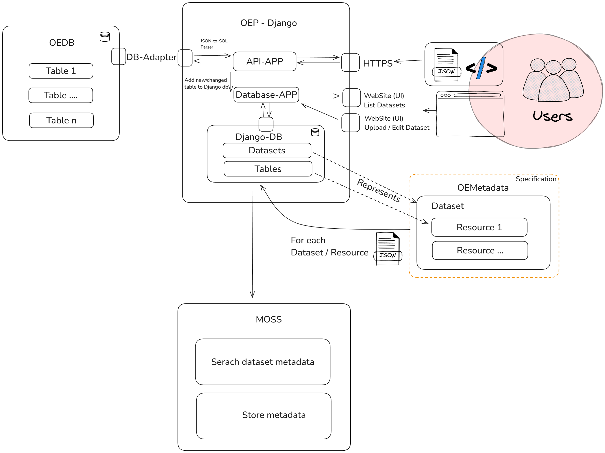

<!--
SPDX-FileCopyrightText: 2025 Jonas Huber <https://github.com/jh-RLI> © Reiner Lemoine Institut

SPDX-License-Identifier: CC0-1.0
-->

# Technology & Architecture

!!! danger "🚧 Feature not yet available"
    Datasets are still in development and not yet fully implemented as described below.
    Currently, tabular data resources are handled individually.

This section describes the technologies and architecture used to implement **Datasets** in the OEP (Open Energy Platform).

---

## Technology Stack

The following software components and specifications form the foundation of the dataset implementation.

### 🧰 Software Components

- **MOSS**
  A microservice that stores metadata documents and provides a high-performance semantic search overlay system.

- **PostgreSQL**
  Primary relational database used to store actual data tables.

- **Django**
  Python-based web framework responsible for business logic, database access, and user interfaces.

- **JavaScript & CSS**
  Used to create interactive and user-friendly experiences in the web UI.

### 📐 Metadata Specifications

- **OEMetadata**
  Custom metadata specification developed for the OEP to describe datasets and related resources using a structured JSON (and JSON-LD) format.

---

## Architecture

This section provides a conceptual overview of how datasets are integrated into the OEP platform.

> 📌 **Goal**: Transition from handling resources individually (per-table) to managing grouped datasets containing multiple resources.

### System Overview

The diagram below illustrates the affected infrastructure components, relevant software modules, and how users will interact with the dataset system:

### Migration Summary

The transition to a dataset-centric model requires several substantial changes:

**Database Module (`dataedit`)**

- Must support grouping resources into datasets
- Requires updated internal data models and database migrations

**API Module (`api`)**

- Needs to allow creating datasets, adding/removing table resources, and accessing datasets via REST

**User Interface**

- Will be updated to present datasets instead of individual resources
- Improves clarity and reduces visual clutter by grouping related elements

### Benefits of the New Architecture

- ✅ Supports **larger and more complex datasets**
- ✅ Enhances **usability** by organizing data meaningfully
- ✅ Enables **dataset-level search and discoverability** through the MOSS microservice
- ✅ Aligns with modern **metadata standards** and FAIR principles

---

The **MOSS microservice** plays a key role in powering metadata search by indexing OEMetadata documents. This greatly improves **findability** and supports FAIR data practices.

!!! tip "💡 Looking Ahead"
    Once fully implemented, the new architecture will streamline data handling, reduce redundancy, and make working with large datasets on the OEP much more efficient.
