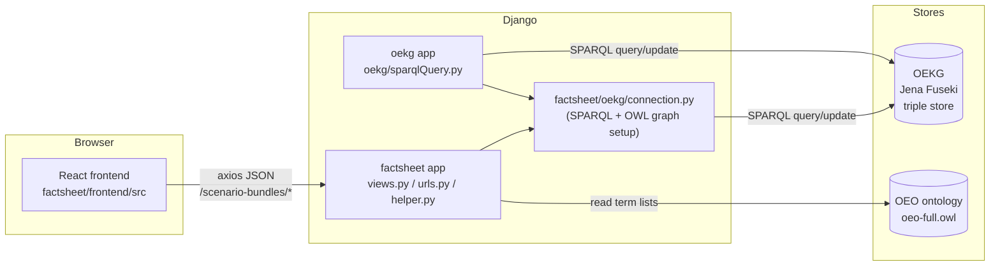

<!--
SPDX-FileCopyrightText: 2026 Jonas Huber <https://github.com/jh-RLI> © Reiner Lemoine Institut

SPDX-License-Identifier: CC0-1.0
-->

# Scenario Bundles — architecture & developer guide

!!! note "Living document"

    This page is a developer-oriented map of how the Scenario Bundles feature is
    wired together. It is expected to grow and be corrected over time — if you
    touch this area and something below is stale, please update it in the same PR.
    Line numbers are pointers, not contracts; treat them as "look near here".

The user- and API-facing overview lives on the
[Scenario Bundles feature](index.md) page (what a bundle is, and the
create/get/update/delete JSON API). This page is about the **code**: which app
owns what, how the layers talk, and where to make a change.

## The three layers

A scenario bundle is authored in a **React** UI, processed by a **Django** app
(`factsheet`), and stored as RDF triples in the **OEKG** (a Jena Fuseki triple
store), with terms drawn from the **OEO** ontology.

- **Frontend** — `factsheet/frontend/src/` (React, built with Vite). Authoring,
  overview, comparison and history views.
- **Backend** — the Django `factsheet` app (URL prefix `scenario-bundles/`).
  Turns JSON payloads into RDF and back.
- **Graph store (OEKG)** — Apache Jena Fuseki, reached over SPARQL.
- **Ontology (OEO)** — the Open Energy Ontology, the source of the controlled
  vocabulary (sectors, technologies, study descriptors, …) offered in the form.

## Where the code lives

| Concern                                  | Location                                                                                    |
| ---------------------------------------- | ------------------------------------------------------------------------------------------- |
| Django app (views, URLs, helpers)        | `factsheet/`                                                                                |
| URL routing (`scenario-bundles/` prefix) | `oeplatform/urls.py`, `factsheet/urls.py`                                                   |
| React source                             | `factsheet/frontend/src/`                                                                   |
| Frontend build config                    | `vite.config.mjs` (entry `factsheet: ./factsheet/frontend/src/index.jsx`)                   |
| OEKG/OEO connection + query wrappers     | `factsheet/oekg/connection.py`, `factsheet/oekg/filters.py`, `factsheet/oekg/namespaces.py` |
| Reusable SPARQL query module             | `oekg/sparqlQuery.py` (top-level `oekg` app)                                                |
| SPARQL UI (YASGUI)                       | `oekg` app (`oekg:main`)                                                                    |

!!! warning "Two things are called `oekg`"

    - `factsheet/oekg/` — an **internal package** of the `factsheet` app. Holds the
      connection setup: the `SPARQLWrapper` clients (`sparql`, `update_endpoint`)
      and the in-memory OEO graph (`oeo`, `oeo_owl`).
    - `oekg/` (repo root) — a **separate Django app** with the reusable
      `sparqlQuery.py` query functions, models, views, and the YASGUI SPARQL
      explorer. See its own `oekg/README.md`.

    New OEKG-interaction functionality should live in / extend the top-level
    `oekg` app; the `factsheet` app imports from it.

## Frontend

Django serves a single template for every scenario-bundles route
(`factsheets_index_view`, `factsheet/views.py`); the React app reads
`window.location.pathname` and routes client-side in
`factsheet/frontend/src/App.jsx`:

| Route                                                   | Component                                 | Purpose                                       |
| ------------------------------------------------------- | ----------------------------------------- | --------------------------------------------- |
| `scenario-bundles/main`                                 | `home.jsx` → `components/customTable.jsx` | All-bundles overview / listing + filter       |
| `scenario-bundles/id/<uuid>` or `/new`                  | `components/scenarioBundle.tsx`           | Create / edit / view one bundle (tabbed form) |
| `scenario-bundles/compare/…`                            | `comparisonBoardMain`                     | Compare bundles                               |
| `scenario-bundles/oekg_history`, `…/oekg_modifications` | history / diff views                      | Change history                                |

The bundle authoring form (`scenarioBundle.tsx`) is organised into tabs; the
**"Sectors and technology"** tab and the **study descriptors** section are the
parts fed by the OEO (see below). The frontend talks to Django with `axios`,
posting/getting JSON to `scenario-bundles/<name>/` endpoints; a CSRF token is
included on write requests.

## Backend & data flow

The `factsheet` views translate between the frontend JSON (see the
[example payloads](index.md#code-documentation)) and RDF triples in the OEKG.

- **Bundle lifecycle** — `add/`, `get/`, `update/`, `delete/` map to view
  functions in `factsheet/views.py`. On write, the JSON is parsed and emitted as
  triples (e.g. sectors/divisions via predicate `OEO_00390079`); on read,
  triples are re-assembled into the JSON the form expects.
- **Populating the form's option lists** — `populate_factsheets_elements_view`
  (`factsheet/views.py`, URL name `populate-factsheets-elements`) returns the
  controlled-vocabulary lists the form renders: `sector_divisions`, `sectors`,
  `scenario_descriptors`, `technologies`. The React form fetches this once when
  it loads (`scenarioBundle.tsx`).
- **Listing & filtering** — the overview (`customTable.jsx`) fetches
  `scenario-bundles/all/`; filter queries run through `oekg/sparqlQuery.py`
  (e.g. `scenario_bundle_filter_oekg`, `list_factsheets_oekg`).

### Two ways to reach the OEO

Both patterns are established in the codebase; pick per use case:

1. **In-memory OWL graph** — `oeo` (an `rdflib.Graph` parsed from the on-disk
   `oeo-full.owl`) and `oeo_owl` (owlready2), set up in
   `factsheet/oekg/connection.py`. Used for ontology-structure reads: class
   hierarchies, labels, definitions (`IAO_0000115` / SKOS / `rdfs:comment`). See
   `build_sector_dropdowns_from_oeo` and `get_all_sub_classes` in
   `factsheet/helper.py`.
2. **Live SPARQL endpoint** — the `sparql` / `update_endpoint` clients
   (`SPARQLWrapper`) in `factsheet/oekg/connection.py`, driven from
   `oekg/sparqlQuery.py`. Used for querying/updating the **OEKG instance data**
   (the bundles themselves). More efficient for data than parsing a graph into
   Python objects.

## The OEO-driven form fields

Several form fields offer terms from the OEO. All of them are now sourced from
the ontology; the payload is assembled by `populate_factsheets_elements_view`
and served at `scenario-bundles/populate_factsheets_elements/`.

| Field                      | Sourced from                                                                                                                  | Dynamic?        |
| -------------------------- | ----------------------------------------------------------------------------------------------------------------------------- | --------------- |
| Sectors (under a division) | OEO graph via `is defined by` (`OEO_00000504`), `factsheet/helper.py`                                                         | ✅ queried live |
| Sector **divisions**       | OEO graph, `build_sector_dropdowns_from_oeo`, `factsheet/helper.py`                                                           | ✅ queried live |
| Study **descriptors**      | OEO graph, terms annotated `oekg annotation` (`OEO_00020425`) with a value starting `study descriptor`, `factsheet/helper.py` | ✅ queried live |
| Technologies               | OEO graph, served by `populate_factsheets_elements_view`                                                                      | ✅ queried live |

Both builders are **memoized at module level** on first call, because the OEO
only changes when the process restarts.

### Sector divisions

`build_sector_dropdowns_from_oeo` returns `(divisions, sectors)`. Two things
about it are easy to get wrong and are pinned by
`factsheet/tests/test_sector_dropdowns.py`:

- **Divisions are modelled two ways in the OEO.** Some carry their members as
  individuals (KSG, CRF 2006); others are classes whose members declare the
  division through an `rdf:type` restriction (NC/BR, EU legislation). An
  individual-only query misses the second kind entirely — which is what the
  former hardcoded list papered over. Each division reports which it is via
  `kind` (`individuals` or `tree`).
- **A division with no members is still listed** (NACE has none), and the
  division asserting `is defined by` about itself is filtered out of its own
  options — CRF 2006 offers 108, not 109.

The last entry is the `Other` division, which carries the full sector tree
rather than a flat list. The legacy flat `sectors` list is still served
alongside, so older consumers keep working.

### Study descriptors

Served as `study_descriptors`, an array of `[label, iri, definition]` triples —
the same shape as the former hardcoded `StudyKeywords` array, so consumers did
not have to change their rendering. The annotation match is deliberately a
prefix, because the OEO carries both `study descriptor` and the inconsistent
`study descriptor tag`.

Three places consume the list, by **two different routes** — worth knowing
before changing the shape:

- bundle **edit** checkboxes and **overview** chips — `scenarioBundle.tsx`,
  which already fetches the populate endpoint for its other fields and reads
  `data.study_descriptors` straight off that payload
- the all-bundles **filter** dialog — `FactsheetFilterDialog.jsx`
- the **comparison** board — `comparisonBoardItems.jsx`

The latter two use the `useStudyDescriptors` hook
(`scenarioBundleUtilityComponents/useStudyDescriptors.js`), which holds a
module-level cache and a shared in-flight promise, so N mounts trigger one
request. It also exports `getStudyDescriptors()` for plain helper functions,
returning `[]` until the fetch resolves.

`customTable.jsx` is not a consumer: it holds the selected-keyword state and
passes it down to the filter dialog, which resolves the labels itself.

## Related surfaces

- **OEKG SPARQL explorer** — the `oekg` app exposes a YASGUI query UI
  (`oekg:main`), linked from the Scenario Bundles navbar dropdown
  (`base/templates/base/_header.html`).
- **OEKG chat** — an external chatbot for asking questions about the OEKG,
  `https://oekg-chat.openenergyplatform.org/`. (Being linked from the Scenario
  Bundles nav and the overview page — see the wayfinder map.)
- **OEKG Web-API** — see [OEKG API](../../web-api/oekg-api/index.md) and
  [Edit scenario datasets](../../web-api/oekg-api/scenario-dataset.md).

## How to extend this feature

- **Add / change a form option list:** decide OWL-graph vs SPARQL (above), add
  or adjust the query in `factsheet/helper.py` (ontology structure) or
  `oekg/sparqlQuery.py` (instance data), expose it through
  `populate_factsheets_elements_view`, and consume it in `scenarioBundle.tsx`.
- **Add a bundle field:** thread it through the create/get/update views in
  `factsheet/views.py` (JSON ⇄ triples) and the matching form tab in
  `scenarioBundle.tsx`.
- **Rebuild the frontend:** `npm run build` (Vite; output under `assets/`,
  served via django-vite). See the
  [frontend workflow](../../../dev/frontend/workflow.md).
- **Add an addressable sub-resource to the REST API:** add a field table and a
  `BundlePart` entry, then a route. The machinery works against a subject plus a
  table rather than against the bundle, so a new part is a table entry and a
  route — not a module. See [The API write path](#the-api-write-path).

## The API write path

The feature has **two** write paths, and everything above this section describes
the first one: the UI's. Session-authenticated RPC endpoints in `factsheet/`
build the bundle triple by triple through rdflib, which is a thin client over
Fuseki — so a create writing ~200 triples is ~200 HTTP requests, and it is not
atomic.

The second is the **OEKG REST API** under `/api/v0/scenario-bundles/`, in the
`oekg` app. It is a standalone surface built beside the UI's rather than on top
of it, and it differs from the UI path in four ways a contributor needs to know
before touching it:

- **One request, one transaction.** The API does not use rdflib as transport. It
  builds the graph in memory and sends **one** SPARQL update request, and one
  update request is one transaction across `;`-separated operations. A write
  therefore either lands whole or not at all.
- **The shape is enforced before the write.** The canonical SHACL shape comes
  from the [`oekg` repository](https://github.com/OpenEnergyPlatform/oekg) as a
  build-time artifact — `manage.py fetch_oekg_shapes` — and the API validates
  the bundle's **post-state** in-process before committing. Validating a `PATCH`
  diff instead would pass vacuously, because nothing targets an untyped node.
- **A write is judged by what it _introduces_.** The pre-state is validated too,
  and only violations the write adds are refused. Without this the API could not
  write to any bundle the browser had created. A create has no pre-state and so
  stays strict.
- **Writes are guarded by a version.** Every mutating request carries the
  version it believes it is editing; the guard binds that version _and the
  bundle's existence_ into the update's `WHERE`, and reads a write token back to
  tell a winner from a loser.

Two constraints hold for anything added here. The API **must not import**
`factsheet/oekg/connection.py`, which parses the full OEO at module import; and
the graph store and Postgres cannot share a transaction, so **the graph commits
first** and a failed history write is reported rather than rolled back.

### The write sequence

The sequence every mutating endpoint shares — exists, owned, precondition,
validate the whole bundle, guard, read back, record — lives in one place, so an
endpoint is a payload and a field table rather than a repetition of that order.

#### ::: oekg.writes

#### ::: oekg.preconditions

#### ::: oekg.permissions

### Validation and the shape

#### ::: oekg.validation

#### ::: oekg.shape

### Versioning

#### ::: oekg.versioning

### Transport to the graph store

#### ::: oekg.graph_store

### Payloads and triples

One field table per resource drives both directions, so a field is declared once
rather than written twice.

#### ::: oekg.bundles

#### ::: oekg.fields

#### ::: oekg.reads

### History

#### ::: oekg.history

### Shared endpoint behaviour

#### ::: oekg.api_support

## API reference

For request/response shapes and endpoint URLs, see the
[Scenario Bundles feature page](index.md#code-documentation).

#### ::: factsheet.views
